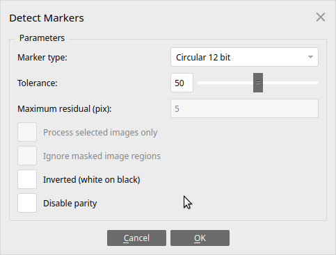
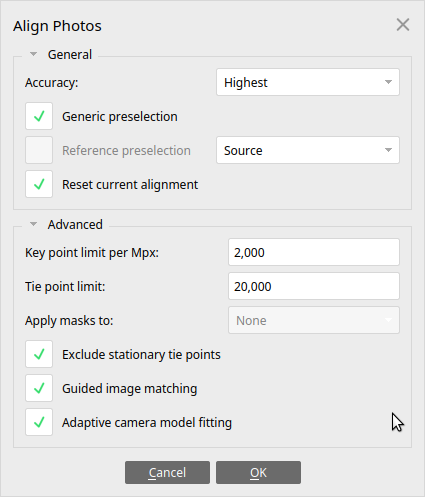
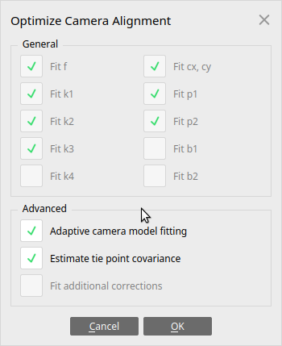
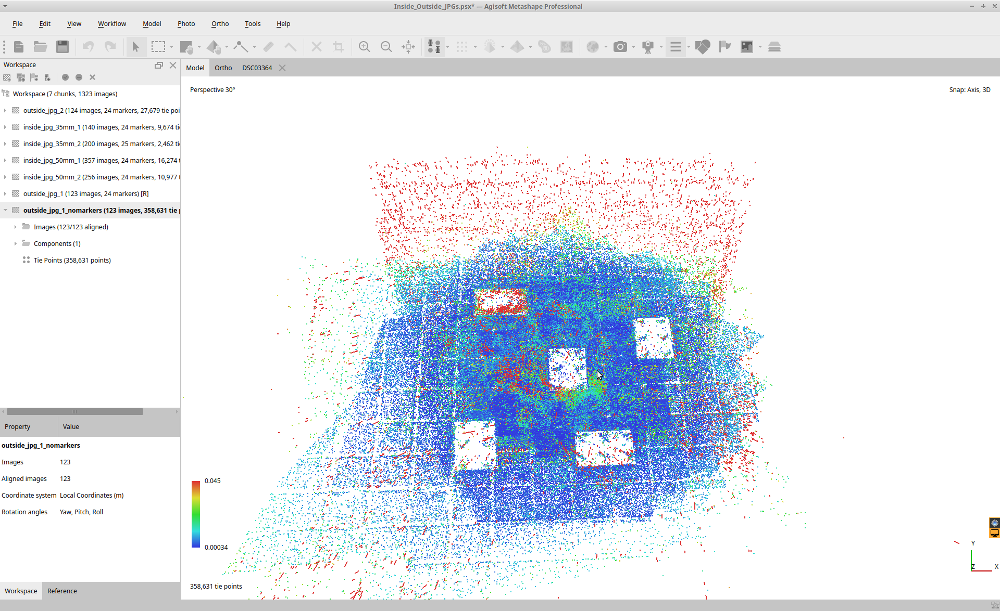
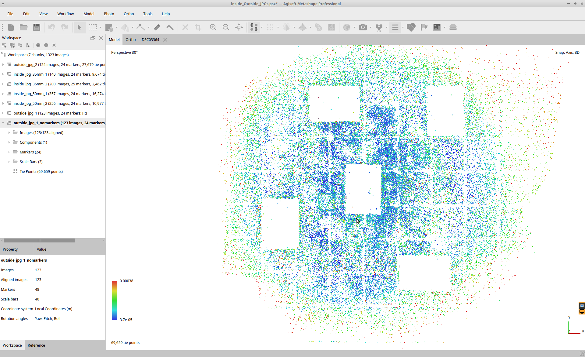
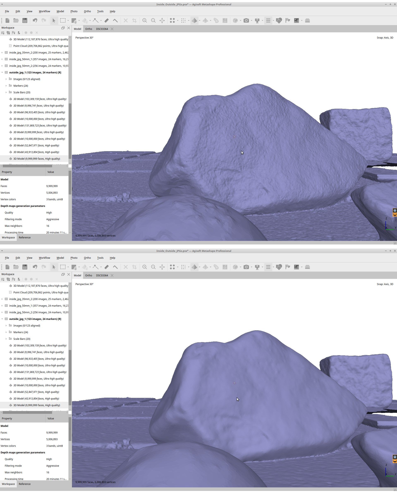
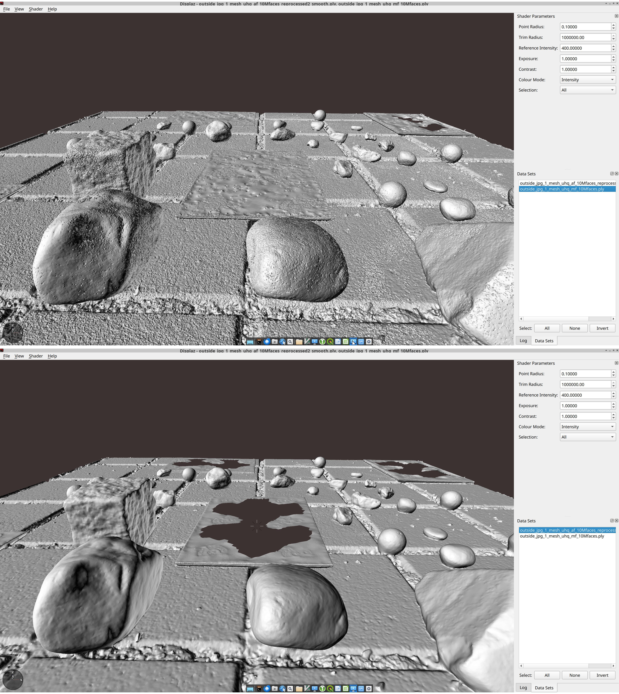

---
title: "Mesh generation with Metashape Agisoft"
author: [bodo.bookhagen@uni-potsdam.de]
date: "18-04-2025"
keywords: [Agisoft Metashape, SfM, Photo Alignment, mesh, point cloud]
...


# Generating meshes with Metashape Agisoft from high-resolution photos
## General guidelines
Bodo Bookhagen [bodo.bookhagen@uni-potsdam.de](mailto: bodo.bookhagen@uni-potsdam.de)

Metashape Agisoft allows to generate meshes (called model in Metashape) after the initial photo alignment. There is no need to create a point cloud first. The processing is fast and efficient and also works for larger datasets. For some cases it still may be useful to generate a point cloud first and filter the point cloud. For noisy datasets or datasets with insufficient images that require filtering you may achieve better results through a point cloud. For a well-defined scene with multiple images and good image alignment, the mesh generation works well out of the box.

The below steps and guidelines are suggestions. Scenes with different boundary conditions may require different approaches or different parameters. There exist different strategies on successful processing for 3D virtual outcrop generation. The strategies depend on number of photos, their quality, if marker and scaling boards are used and several other factors. There is no 'one size fits all' solution. In the following document we list several guidelines for successful processing. These may need to be adopted to your needs.

## Additional resources

- Metashape Agisoft Tutorials: https://www.agisoft.com/support/tutorials/
- Metashape Agisoft Documentation: https://www.agisoft.com/pdf/metashape-pro_2_0_en.pdf
- Metashape Agisoft User Manuals: https://www.agisoft.com/downloads/user-manuals/
- Metashape Agisoft Python reference: https://www.agisoft.com/pdf/metashape_python_api_2_1_3.pdf
- Metashape Agisoft github repository: https://github.com/agisoft-llc/metashape-scripts
- https://github.com/VietDucNg/Metashape-photogrammetry
- USGS Agisoft Metashape/Photoscan Automated Image Alignment and Error Reduction version 2.0 https://www.usgs.gov/software/agisoft-metashapephotoscan-automated-image-alignment-and-error-reduction-version-20 and associated python code: https://code.usgs.gov/pcmsc/AgisoftAlignmentErrorReduction/-/tree/v2.0 **Note that these steps are aimed at optimizing UAV (nadir) images.**


## Overview of steps

- Load photos into a chunk.
- Load an existing camera calibration file (if available).
- Detect Markers and create scalebars (see python script below).
- Add coordinates of first four markers to ensure that multiple scenes are overlapping and that you have an oriented reference frame.
- Align the Photos with settings: High accuracy, Adaptive camera model fitting, Guided image matching, Exclude stationary key points. The number of key points will depend somewhat on several factors, but for Key point limit per Mpix a value of 1000 to 4000 (with 2000 often used) is suggested and Tie point list should be limited to 10,000 to 20,000 points.
- Run Camera Optimization and ensure to generate the tie point covariances, select Adaptive camera model fitting
- Filter Tie points through gradual selection. **Note that the quality of the mesh will greatly depend on the quality of tie points.** This is an iterative operation.
  - A general strategy is to first remove tie points with an image count or confidence of 2 (i.e., all tie points that have matches only in 2 pairs) - this is achieved by filtering with Image count
  - Rerun Camera Optimization and next filter by reprojection error, reprojection uncertainty, and projection accuracy. General goals are to have a maximum reprojection error of 1 (better 0.5), a reprojection uncertainty of 8 to 10, and projection accuracy of 4.
  - Visibly verify the tie points and only proceed to the model generation step if you are satisfied with the filtering steps.
- Build model from depth maps with high or ultra-high quality setting, aggressive filtering, and a face count of 0. This will generate a maximum number of faces that can be subsequently filtered.
- Clip model to area of interest.
- Decimate mesh to 10,000,000 faces
- Smooth mesh with filter strength 3 - multiple smoothing steps with further smooth the mesh.

In some cases, the detection of markers does not result in accurate camera positions (i.e., the marker detection has a larger uncertainty). This may be the case if there are highly oblique images in the photo stack. If this is the case, you may want to first align the photos and optimize cameras with gradual selection before detecting the tie points and adding the scale bars. The tie point covariances may be lower for an alignment based on dense features instead of weakly defined markers. A more accurate camera position will result in higher mesh qualities. 

# Detailed explanation of steps and strategies

Useful resources are the [Metashape Manual](https://www.agisoft.com/downloads/user-manuals/) with the V2.0 [document](https://www.agisoft.com/pdf/metashape-pro_2_0_en.pdf). 

## Image loading and photo alignment 

If you have an initial camera calibration, it will be useful to load this. Do not use weakly defined camera calibrations. You can perform camera calibration using calib.io or standard opencv approaches [CameraCalibration - github](https://github.com/BodoBookhagen/CameraCalibration).

Standard strategy suggests to first find markers (Tools->Markers->Detect Markers...) and then add coordinates and scale bars. Note that Metashape will consider markers (or targets) to be true matches and will not optimize them. That is, these will need to be accurately identified. This may not be the case for oblique or distorted images.



The coordinates can be added on the reference tab. The coordinate combination will depend on the board orientation, but usually the first reference location (target 1) is [0,0,0], second target is [-0.12, 0, 0], third target [0,0.12,0], and fourth target at [-0.12, 0.12, 0]. 

![Photo with detected markers (or targets). The targets 1 to 4 can be used to define the reference frame. In this example, we have set target 0 to [0,0,0], targer 1 defines the x direction with [-0.12, 0, 0], target 3 the y direction with [0,0.12,0] and target 4 is [-0.12, 0.12, 0].](figs/markerboards.png){width=50%, height=50%}

{width=50%, height=50%}



The setting **Adaptive camera model fitting** should be selected for scenes with a large number of photos. This option enables automatic selection of camera parameters to be included into adjustment based on their reliability estimates. For data sets with strong camera geometry, such as photos taken from all sides including different levels, it will help to adjust more parameters during initial camera alignment.

### Example python code to add markers and scalebars
You will need to install `numpy`` within the Metashape environment following descriptions in their [website](https://agisoft.freshdesk.com/support/solutions/articles/31000136860-how-to-install-external-python-module-to-metashape-professional-package).

The reference locations may need to be edited. This code snippet can be copied and pasted into the Metashape console.

```python
import Metashape
import numpy as np

#manually set to current chunk. Note that this starts counting with 0 for the first chunk.
chunk = Metashape.app.document.chunks[0]

# Detect Markers and add Scalebars (assumes 0.12 m distance between markers)
print("Detect Markers and add Scalebars")
task_dm = Metashape.Tasks.DetectMarkers()
task_dm.apply(chunk)

# add positions for first 4 points - this may need to be edited
chunk.markers[0].reference.location = [0, 0, 0]
chunk.markers[1].reference.location = [0.12, 0, 0]
chunk.markers[2].reference.location = [0, -0.12, 0]
chunk.markers[3].reference.location = [0.12, -0.12, 0]

# add Scalebars based on boards
nr_markers = len(chunk.markers)
nr_of_markers_on_board = 6
for j in range(int(nr_markers / nr_of_markers_on_board)):
    start_marker = j * nr_of_markers_on_board
    for k in range(5):
        if np.mod(k, 2) == 0 or k == 0:
            sb = chunk.addScalebar(
                chunk.markers[start_marker + k],
                chunk.markers[start_marker + k + 1],
            )
        else:
            if k < 4:
                sb = chunk.addScalebar(
                    chunk.markers[start_marker + k],
                    chunk.markers[start_marker + k + 2],
                )
        sb.reference.distance = 0.12

```


## Camera Optimization Filtering tie points
The resulting sparse or tie point cloud is used to determine camera location and camera calibration values. The step is also referred to as Camera Optimization or Bundle adjustment. This step is crucial for high quality results. You will have to validate and filter the point cloud to generate high quality result.



**Covariances**
Estimate tie point covariance can be selected while running the optimization procedure. Metashape will calculate covariance matrix for the bundle adjustment calculations. Covariance matrix captures the uncertainty of the transformation. Covariance matrix diagonal elements are variances and their off-diagonal values are covariances.  The covariances are color coded in Metashape: a vector associated with each tie point indicates the direction and value of the largest error for the tie point estimated position. The color color shows the magnitude of the covariances.
After running `Optimize Cameras ...` display the tie point cloud with their variances.

{width=50%, height=50%}

{width=50%, height=50%}

{width=50%, height=50%}


### Gradual selection
There are multiple approaches to filter the tie points to only contain high-quality points. Because we often don't know which ones are *good* tie points, we often rely on manual editing and visual checking. There are some guidelines and parameters that allow to automatize the process. **This is an iterative approach where the Optimize Cameras step is performed after filtering and remove tie points.**

One approach relies on a large number of tie points that are subsequently filtered. This is often a useful approach for well-defined settings with a good camera geometry. The first step is usually a filter by image count (or confidence): remove tie points that are only found in a low number of photo pairs. Then re-run the Optimize Cameras step and filter by reprojection error (see below). You likely will use a value around 1 for the first iteration, and after removing the tie points and re-running the Optimize Cameras step, you may use a lower value of 0.8. Repeat. In the end, you are aiming at values between 0.5 - 1. The unit is pixels of this attribute - so you would like to align your cameras with subpixel accuracy.


#### Reprojection error
Maximum reprojection error is calculated in normalized units for all images where a tie point was found.

$$\max_i |x'_i - x_i | / s_i$$

where
$x'_i$ are the coordinates of the point projection according to adjusted orientation parameters on the i-th image in pixels, $x_i$ are the measured point projection coordinates on the i-th image in pixels, and si are the scale of the image that was used for measuring the coordinates of the corresponding projection on the i-th image.

High reprojection error usually indicates poor localization accuracy of the corresponding point projections at the point matching step. It is also typical for false matches. Removing such points can improve accuracy of the subsequent optimization step.

The unit of the reprojection error is in pixels and you are likely aiming at a value of 0.5 to 1.


#### Reconstruction uncertainty
Ratio of the largest semi-axis to the smallest semi-axis of the error ellipse of the triangulated 3D point coordinates. The error ellipse corresponds to the uncertainty of the point triangulation alone without taking into account propagation of uncertainties from interior and exterior orientation parameters.

$$\sqrt(\lambda_1 / \lambda_3)$$

where
$\lambda_1$ is the largest eigenvalue of the tie-point covariance matrix and $\lambda_3$ - smallest eigenvalue of the tie-point covariance matrix

High reconstruction uncertainty is typical for points reconstructed from nearby photos with small baseline. Such points can noticeably deviate from the object surface, introducing noise in the point cloud. While removal of such points should not affect the accuracy of optimization, it may be useful to remove them before building models or point cloud geometries. 

Example: In case you have only two cameras and a point is being triangulated by intersection of two rays there is a direction in which the variation for the point position is maximal and another direction with the minimal variation ($\lambda_1$ and $\lambda_3$ above). Dividing one by the other (max to min) will give you the reconstruction uncertainty value. Reconstruction uncertainty is inversely related to the image-pair baseline: if all images that contribute to determining the 3D position of a point are very close together, relative to the distance of that point, then the uncertainty is high (although the reprojection error may well be low). Reconstruction uncertainty is unrelated to how well the cameras are aligned/modelled. It is reflecting the ratio between XY uncertainty and Z uncertainty. If the XY accuracy (usually $\lambda_1$ is equal to the Z accuracy (usually $\lambda_3$) then you get an reconstruction uncertainty of 1. A reconstruction uncertainty of 10 implies that $\lambda_1$ is 10 times as large as $\lambda_3$.

You are aiming at a value of 10 or lower. A range of 8 to 10 is likely a reasonable goal.

#### Image count
Number of image pairs where a tie point was found.

Metashape will attempt to reconstruct tie points that are visible at least in two photos. However, points that are visible only on two photos are likely to be located with poor accuracy. Image count filtering enables to remove such unreliable points from the tie-point list.

Remove all tie points with an image count of 2.


#### Projection Accuracy
Average image scale that was used for measuring coordinates of the projections of the tie-point.

$$s_i / n$$

where
$s_i$ is the scale of the image that was used for measuring the coordinates of the corresponding projection on the i-th image and $n$ is the number of images where the tie point was found. 

This parameter allows to filter out points which projections were poorly localized due to their bigger size.

Aim at values between 4 and 10.

## Mesh (model) generation

Once the cameras are aligned, a mesh can be generated from the depth maps. This step will require some time.

![Example settings for generating a mesh. The quality may be set to ultra high, which means that every image pixel is used to generate a depth map. The setting high will use every other pixel (a factor decrease of 2 in x- and 2 in y-directions resulting in an overall 4x lower depth map). One potential advantage of using lower-resolution depth maps is that these do not require sub-pixel image alignment. Use the aggressive filter to remove outliers on the depth maps. If you expect very thin features in your scenes use a mild or moderate filter. Set number of face counts to 0 to receive a maximum number of mesh vertices.](figs/buildmodel_aggressive.png){width=50%, height=75%}

### Mesh decimation
In most cases we suggest to generate a model with a high number of vertices (or triangles). These can be further reduced in next steps. For high-resolution pebble modeling, we often require more than 1 million face counts. By setting this field to 0, a maximum number of mesh vertices is generated. The mesh can be decimated to 10,000,000 face counts (or the required value).

### Mesh smoothing
If camera locations are not very precise (i.e., sub-pixel accuracy), you may end up with a somewhat noisy mesh surface. This is because the mesh surface is reconstructed out of multiple, overlaying meshes derived from depth maps of imperfectly aligned cameras. This effect can be greatly reduced by smoothing the mesh. Agisoft Metashape includes a simple smoothing filter that removes spikes in the mesh data. Applying the filter multiple times will increase the filter affect. The smoothing filter also reduces curvature values in places and should be use carefully if curvature values are derived on the mesh. In general applying the smoothing filter with standard strength of 3 once has an enhancing effect. Apply twice if the mesh contains large number of spikes.

{width=50%, height=75%}


### Quality assessment

{width=50%, height=50%}

{width=50%, height=50%}

{width=50%, height=75%}

# Metashape Python script

We have generated a python script `Metashape_process_and_filter_to_mesh.py` that can be run within the Metashape console to perform all processing steps in one go. We note, however, that the default settings may not produce the optimal results in all cases. For a setting with excellent camera geometry (cameras from different angles, heights, and direction) and high image overlap, it is generally easier to generate a high-quality model.

The included script requires Metashape to have the `numpy` package installed (see [Metashape website](https://agisoft.freshdesk.com/support/solutions/articles/31000136860-how-to-install-external-python-module-to-metashape-professional-package)). 

To prepare the script run, images should be loaded into separate chunks with their appropriate names (mesh output name will use the chunk name to save a ply).

The script does the following steps for all chunks loaded in the current project:
- detect markers
- creates scalebars with a distance of 0.12 m between target markers
- adds coordinates to the first four targets
- performs photo alignment and camera optimization steps
- filters tie points several times to remove noisy tie points (*this section may be edited or parameters changed*)
- creates a mesh with the max. number of faces at the full image resolution
- decimates the mesh to 10 M faces and applies a smoothing filter
- saves a ply file that can be read by open3D or other software environments
